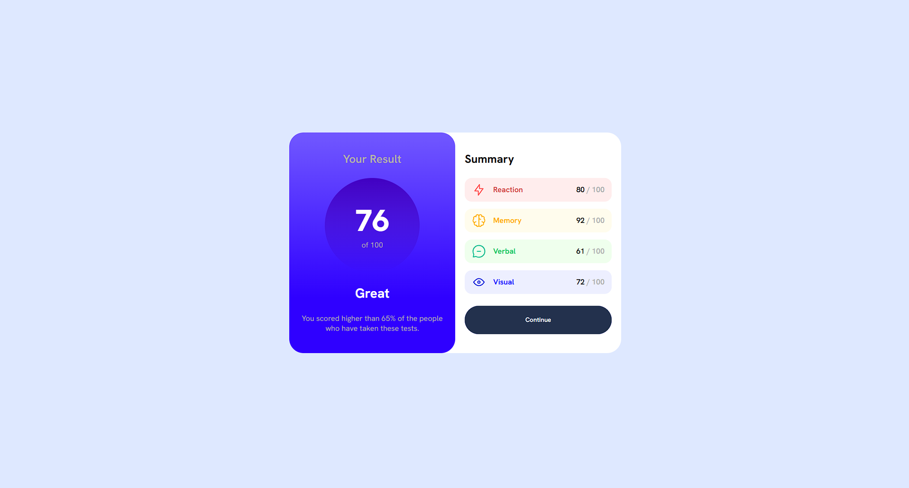

# Frontend Mentor - Results summary component solution

Heya, this is a challenge from frontendmentor

### Screenshot

### Links

- Solution URL: https://github.com/CodingDango/frontendmentor-results-component
- Live Site URL: https://codingdango.github.io/frontendmentor-results-component/

### Built with

- Semantic HTML5 markup
- CSS custom properties
- Flexbox
- CSS Grid

**Note: These are just examples. Delete this note and replace the list above with your own choices**

### What I learned

Learned how to deal with JSON Parsing, and how to deal with
transitions regarding colors to linear-gradients.

### Useful resources

- (https://m.youtube.com/watch?v=cuEtnrL9-H0&t=6m19s) - Helped me with fetching JSON's.

- (https://stackoverflow.com/questions/6542212/use-css3-transitions-with-gradient-backgrounds) - Helped me with transitioning with gradients backgrounds.
